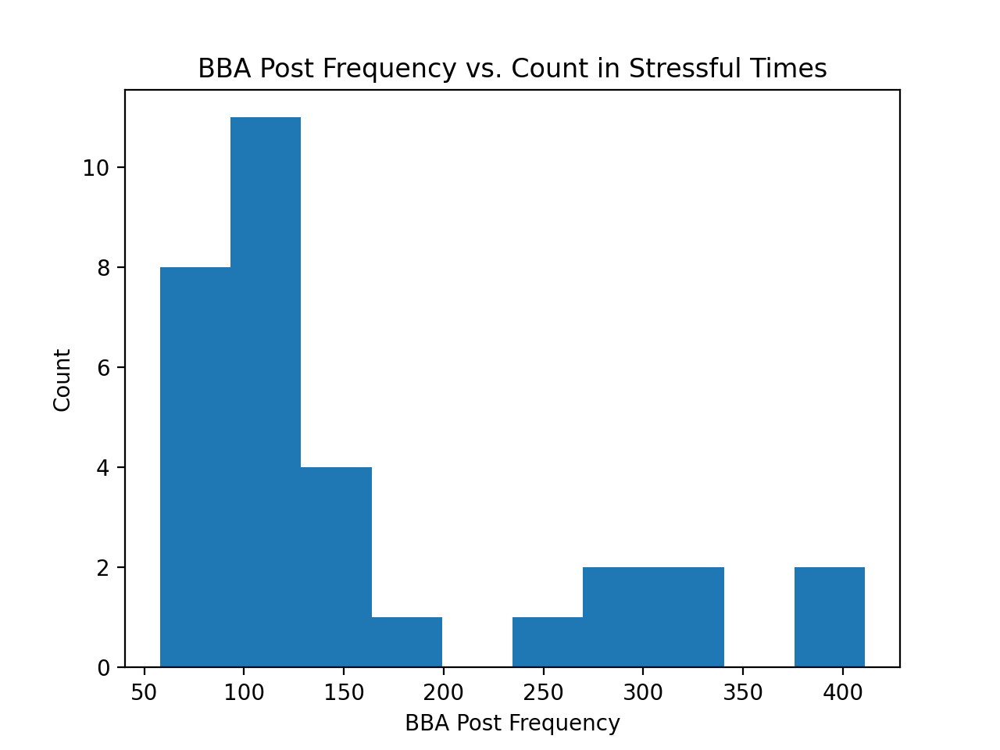

# Tech Report

## Hypotheses ##

Null Hypothesis:
The average weekly frequency of posts on Blueno Bears Admirers (BBA) or the average weekly sentiment of posts on Dear Blueno (DB) do not change in high or low stress periods.

Alternate Hypothesis:
The average weekly frequency of posts on Blueno Bears Admirers (BBA) or the average weekly sentiment of posts on Dear Blueno (DB) are different in high and low stress periods.

## Statistical Test ##
For both the BBA and Dear Blueno hypotheses, we gathered data for each relevant week of posting. We then separated the data into 4 CSV files: BBA post frequency in stressful weeks (bba_stressful.csv), BBA post frequency in non-stressful weeks (bba_non_stressful.csv), DB average post sentiment in stressful weeks (db_stressful.csv), and DB average post sentiment in non-stressful weeks (db_non_stressful.csv). We concluded that weeks surrounding shopping period, reading period, and finals would count as stressful weeks and all other periods would count as non-stressful weeks. 

The goal was to determine if there is a statistically significant difference between the means of BBA stressful and non-stressful post frequency, and DB stressful and non-stressful post sentiment. Initially, we wanted to use a two-tailed T test, since the population size was fairly small (31 stressful BBA and 17 stressful DB). Doing so gave large p-values for both BBA and DB. However, we realized the population distribution for BBA and DB were not normal (or t-distributed). 

BBA Histogram:

DB Histogram:
![DB Histogram] (../visualizations/db_stressful_hist.png)

Since the distributions were not normal, we decided to use the **Mann-Whitney U test**. This test is non-parametric, so it does not require the populations to be normal. Our data is not paired and has fairly small sizes, so we thought the Mann-Whitney test would work well. We used scipy's stats library, which has a Mann-Whitney U test that outputs a p-value after comparing two datasets. We used a two-sided hypothesis for the function. Although the Mann-Whitney test usually compares U to u(n1, n2, a), the library converts this to a p-value. Thus, with p < 0.05, we can reject the null hypothesis. With p > 0.05, we would accept the alternative hypothesis.

## Results ##
The Mann-Whitney U test for BBA gave us a P-value of **0.660**. The test for DB gave us a P-value of **0.366**. Because these p-values are greater than 0.05, we fail to reject the null hypothesis. With these results, we are pretty sure that periods of stress have no effect on BBA or DB, regardless if that effect is negative or positive. 

While our p-values suggest that our conclusion should have high confidence, there are a couple variables that could have skewed our results. First, while we had thousands of indiviual posts to go through for both forums, when converted those into weekly results, thus our population sizes became small. We would have to wait until these forums were a little older and had more data to rectify this. Also, we used VADER from the nltk python library for sentiment analysis. While this analysis works well for tweets and "internet slang", we did some testing on it using some Dear Blueno post content and realized that it may not be as accurate on DB posts as we had wanted. To rectify this, we would have to create our own nlp program for sentiment analysis, or train an existing one with data from the DB posts. 

### Visualization ###
We used bar plots to visualize our results (see below), highlighting stress periods in red and non-stress periods in blue. We decided against using BBA posts in the summer, as the reason posts are so sparse then is because no one is on campus, rather than because of stress, so we colored that data gray. From the graphs, it is pretty clear that the red bars and the blue bars have no significant differences, but we also added our p-values and U-values to the chart as well. 

We thought of using scatter plots, but we did not think the heights were as distinct in that form. Also, the x-axis is still time, but using a scatter plot would give it more emphasis than we wanted. Our data is split up into 2 groups dependent on time, so we believed that highlighting those groups in different colors was the best way to go. 

DB Bar Graph: 
![DB Bar Graph] (../visualizations/db-chart.png)

BBA Bar Graph:
![BBA Bar Graph] (../visualizations/bba-chart.png)

## Conclusion ##

We failed to reject the null hypothesis, meaning that we have high confidence that whether the time of year is stressful or not does not correlate with post sentiment or frequency for these anonymous online forums. If we were to continue to look into this, we would probably try to, first, wait for more data to be available. If this experiment were done 5 years in the future (and these forums were still in use), then our results would be more reliable. We would also try to curate our own sentiment analysis NLP algorithm tailored to DB to increase the accuracy of the analysis. Again, this would also probably require more data than is currently available. We could also myabe have chosen different periods of time as "stressful weeks" (maybe midterms?). However, given our current data, we believe we can say with pretty high confidence that post frequency and and post sentiment does not correlate with stressful periods of time for students. 
